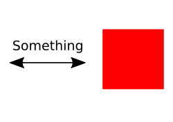

Ancient greeks wanted to figure out how the the world is made up.
Acidentlly they described ways to describe to world/reality in structured ways.

**Programming is philosphie (and math)!**

## How to structure something complex using simple forms?

 

## Objekt Orientation (a la Plato):

Object Orientation **helps you think, it does not make the program faster or better! It just makes it structured!**

## Inheritance and Prototyping (a la Goethe & Friends):

## Functional Programming (a la Pythagoras, Leibniz, Euler)

# You only need structure when the program gets complicated, but then it is too late to structure it! So start with structure even if there is no initial benefit! Also never become an extermist (unless you are already using an extremistic language like scala, then it is "when in Rom")!
